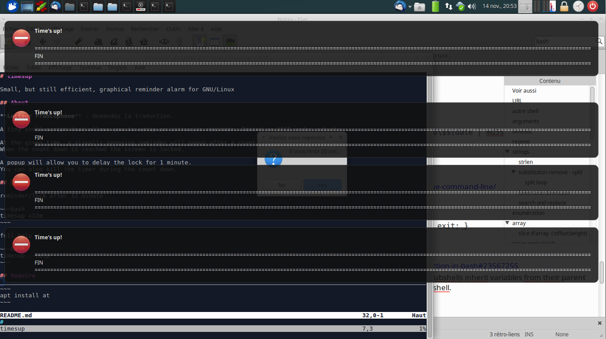

# timesup

Command line reminder alarm for GNU/Linux, with graphical display for XFCE.

## About

**Lecteur Francophone** : demandez pour une traduction.

A tiny shell script that allows you to setup an intrusive reminder/lock. Tested on XFCE under xubuntu.

At the given time, a visually annoying reminder will popup after a count down.
A popup will allow you to delay the lock for 1 minute.
When the popup delay is reached the screen is locked.

You can also kill the timer during the count down.

The goal of this command is to stop yourself when you need it.

## Usage

reminder/lock after 12 minutes

~~~bash
timesup +12m
~~~

full help

~~~bash
timesup --help
~~~

kill the timer (during the count down)

~~~bash
timesup skip
~~~

at list tasks

~~~bash
atq
~~~

kill a task

~~~bash
atrm 1234
~~~

## Require

Use at to schedule timed command (itself).

~~~
apt install at
~~~

## Screenshot

## See Also

* https://github.com/anko/hudkit - HUD Head-Up Display
* https://wiki.archlinux.org/index.php/Desktop_notifications
* http://superuser.com/questions/164047/how-to-get-accurate-window-information-dimensions-etc-in-linux-x
* https://github.com/the-cavalry/light-locker/issues/85 - delay or prevent login for an short period after locking screen
